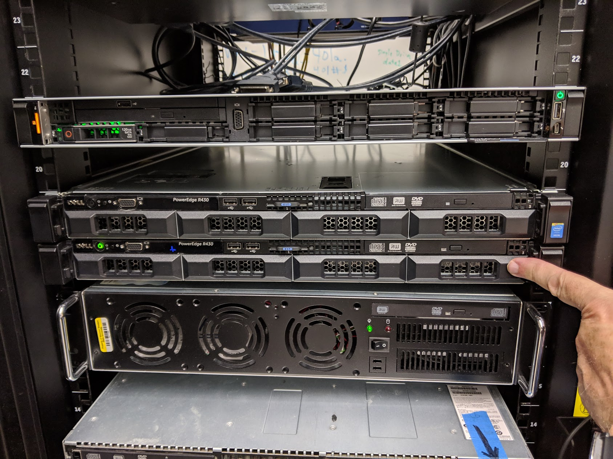

# Unit 01

## ***Connecting, Commands, Man Pages, and Passwords***

Parental Warning:  Some of the cowfiles may be NSFW.  The ones I am using in examples are SFW.  If you go exploring be over 18 and be prepared for possible objectionable images.

## Choices

A Unix or Linux course can be taught several ways

* Students use computers in an on-campus lab
* Log into a remote system
* Students use Raspberry Pi systems
* Students use virtual machines
* Students dual boot their laptops or use recycled laptops
* Use a cloud system

## Our working environment for the first part of the course

### Motivations

In the first part of the semester we will be connecting to the same server.  
There are several reasons for this:

* Easier setup for students at the start of class
* Everyone is working in the same environment
* Students may use the server for other classes
* The environment is less likely to be damaged by a sudo accident.
* Remote server is a realistic working scenario
* We can have some fun.

### woz.cs.missouriwestern.edu 

### Terms that mean about the same thing:  

* terminal window 
* console 
* command prompt 
* CLI (Command Line Interface)

## Connecting

The way you connect will depend largely on your operating system.

* Mac and Linux:  You should be able to use SSH.  See the SSH page.
* Windows: See the page on Putty.  I recommend that Windows users start with a program called "Putty."  If you have a late version of Windows 10 with WSL2 installed you may also be able to use ssh directly from a command prompt.  But if you are already kind of lost I suggest you start with Putty.

### Login Id and password

Your login should be the same as your Missouri Western goldlink login id.

Your password will be provided by your instructor

In the following examples, the userid is *abyron* but yours will be different
