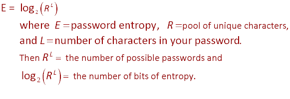

# Picking a decent password

## New commands used in this video or the assignment

* makepasswd
* xkcdpasswd
* passwd

## Passwords are important

* Financial or business resources
* Personal resources
* Use as a spoofing platform
* Mess with you

## Bits

A bit is a place that stores a 0 or a 1.

If you have 2 bits you can have up to 4 combinations

```text
0 0
0 1
1 0
1 1
```

If you have 3 bits you can have up to 8 combinations

```text
000
001
010
011
100
101
110
111
```

In general, if you have n bits, then the number of combinations is 2<sup>n</sup>

| number of bits | unique patterns |
| :------------: | :-------------: |
|       1        |        2        |
|       2        |        4        |
|       3        |        8        |
|       4        |       16        |
|       5        |       32        |
|       6        |       64        |
|       7        |       128       |
|       8        |       256       |
|       9        |       512       |
|       10       |      1024       |
|       20       |    1,048,576    |
|       30       |  1,073,741,824  |

## Entropy

Entropy is lack of order or predictability.  For passwords, password strength is measured in bits of entropy.



Range is the number of characters in the character set

| Description                    | Range |
| ------------------------------ | :---: |
| digits only                    |  10   |
| lower case only                |  26   |
| upper case only                |  26   |
| upper+lower                    |  52   |
| upper+lower+digits             |  62   |
| upper+lower+digits+10 specials |  72   |

### Length beats Range

Length is the exponent.  A small increase in length is more powerful than increasing the range.

Current wisdom is passwords of 15 characters are excellent.

### [Entropy Calculator](http://rumkin.com/tools/password/passchk.php)

* The following table is now considered too conservative.  
* Probably bump each category up 1 level.  
* :star: IT Professionals should have all passwords above 65 bits of entropy. :star:
* 128 is now considered standard for major assets

| Bits of Entropy | Strength                                                                  |
| :-------------: | ------------------------------------------------------------------------- |
|    < 28 bits    | Very Weak; might keep out family members                                  |
|  28 - 35 bits   | Weak; should keep out most people, often good for desktop login passwords |
|  36 - 59 bits   | Reasonable; fairly secure passwords for network and company passwords     |
|  60 - 127 bits  | Strong; can be good for guarding financial information                    |
128+ bits | Very Strong; often overkill

## Pass Phrases

One standard piece of advice is to think of "Pass Phrases" rather than "Passwords."  This is not bad because it gives length.

* A line of a song or poem
* A story or something about you
  * works@courtHouse
  * $Generalstore1703
* Something about the website
  * ```angry14yearOlds``` might work for Reddit
  * ```AnnoyingRelativesUCan'tUnfriend``` might work for facebook.

## How to weaken passwords

Use common passwords

* See [this list of longstanding popular passwords](https://en.wikipedia.org/wiki/List_of_the_most_common_passwords)
* Hot password of the era.
  * "Donald","Joe" "Biden" and "Trump" are popular now along with common variations.
  * Any password or username used in a movie or TV show
  * *Requiring* users to use upper case, numbers, etc.

Reuse passwords

[Relevant XKCD cartoon](https://xkcd.com/792/)

The dilemma:

* Specifying Caps, lower case, digits, etc. lowers the entropy
* Many users will use a poor range if given a chance.

Solution:  Require special characters and require longer passwords.

## Picking Passwords

### Linux commands

```bash
$ makepasswd
```
These are pretty short.  A password should have at least 15 characters.  A better password would be generated by the following command.  It creates a password with a minimum length of 15 characters, and a maximum length of 20.

```bash
$ makepasswd -m 15 -M 20
```

### XKCD method

[Mandatory XKCD Password Cartoon](https://xkcd.com/936/)

```bash
$ xkcdpass
```

To me it seems like the XKCD author only thought you would use one password for many things.

### Generating a random number (not on quiz)

```bash
$ echo $RANDOM
```

### Manually make up a password

* Generate 2 words with 3 to 5 characters
* Generate a 2 or 3 digit number.  You could use ```echo $RANDOM``` and use the last 2 or three digits.
* Pick two symbols.  Make sure they are easy to type on your phone, like . and ,

Now mix the two words, the numbers, the characters plus the first 3 letters of the domain you are using

* relayBackwater27MIS.,
* MIS27relay.,backwater
* relay27MIS.,backwater

Now you have a password that is at least a little bit unique for each website.  But if someone sees your pattern you have a problem.

* divide up the 3 letters: MrelayIBackwaterS27.,
* do the letters backwards: relaySIMBackwater27.,
* use Morse Code: relay27Backwater.,dddddDD

## The real solution

The real problem with passwords is password reuse.  

Password managers

* Either on the cloud or on your own device
* Works best for websites
* Don't work as well for desktop applications and desktop logins

## Another factor

Two factor authentication

* Phone
* Phone based 6-digit authenticator
* Device such as a [Yubi Key](https://www.yubico.com/) or [Google Titan](https://cloud.google.com/titan-security-key) device. 

Most password managers work with devices.  Make sure you have a device and a backup device.

## Alternatives

* ssh key exchange
* Biometric