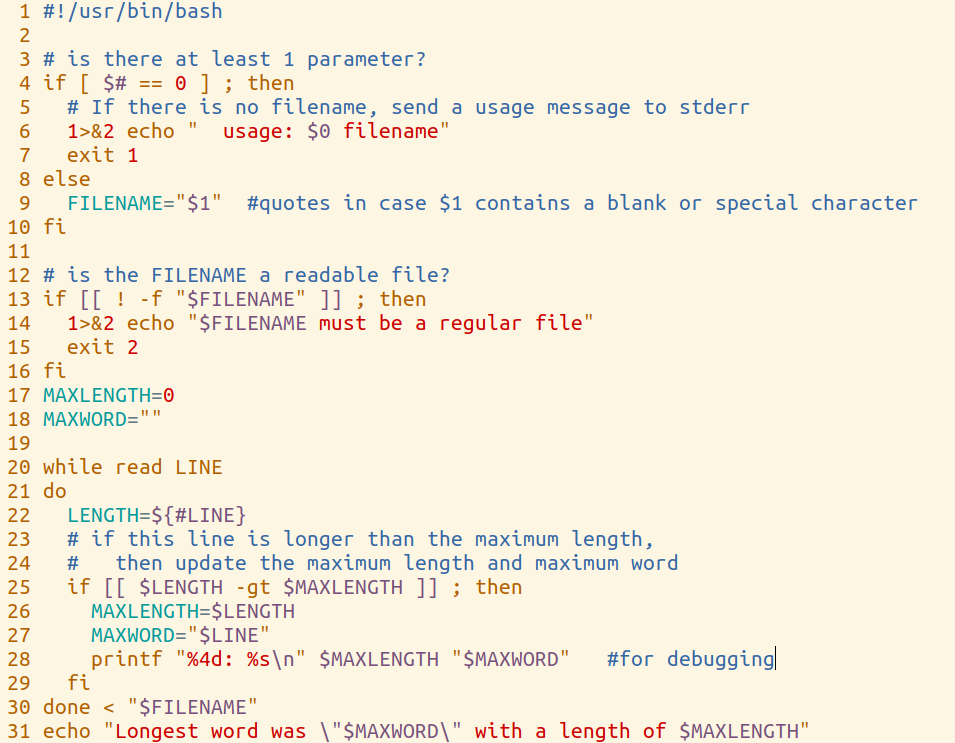

Unit 11.040 ```while``` Loops

## ```while``` vs ```for```

The general guidelines in almost all computer languages are:

* for loops should be used only in cases where it is possible to know how many times the loop will execute *before the loop starts.*  This means it is a counting loop.
  * Indexed by an integer where the start, end, and increment are known in advance
  * items on a list, where the members of the list or array are fixed before the loop starts
* while loops are for cases where it is not known at the start of the loop how many times the loop will execute.
  * User input decides when the loop will stop
  * The loop is controlled by some Operating System or external value
  * The loop is controlled by a random number of some type
  * The loop is controlled by number of lines in a file that is being read
  * It is designed as an infinite loop

## Basic syntax

```bash
while boolean
do
   statements
done
```
alternate form:

```bash
while boolean ; do
   statements
done
```

## An example

```bash
#!/usr/bin/bash
read -p "Type a word, or press enter by itself to quit > " WORD
COUNT=0
while [[ $WORD ]]
do
    printf "You typed \"$WORD\"\n"
	((COUNT++))
    read -p "Type a word, or press enter by itself to quit > " WORD
done
echo "You entered $COUNT words"
```

## A more complete example

