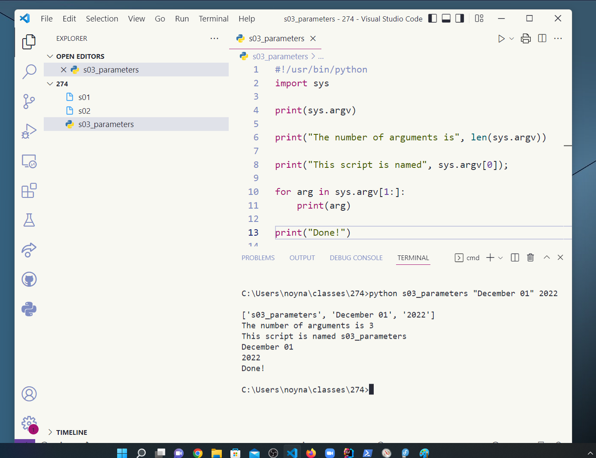

# 15.030 Python for Simple OS Operations

A lot of basic (and not so basic) functions are built into python using standard libraries.

* [import sys](https://docs.python.org/3/library/sys.html)
* [import os](https://docs.python.org/3/library/allos.html)

```python
#!/usr/bin/python
import sys

print(sys.argv)

print("The number of arguments is", len(sys.argv))

print("This script is named", sys.argv[0]);

for arg in sys.argv[1:]:
    print(arg)

print("Done!")
```

Most of the functions are not specific to Linux.  A lot of the operations work on Windows as well as Linux.

